<title>英雄联盟长线运营：三个系统问题与改进方案</title>

系统策划 / 活动运营方向个人作品。研究对象为 PC 端《英雄联盟》Riot 国际服，资料截至 2026 年 9 月 18 日。

# 决策摘要

| 项目 | 现在的问题 | 改动 | 成本（估算） | 需要的决定 |
|-|-|-|-|-|
| 通行证目标提示 | 界面只显示等级，玩家算不出还要玩多久 | 奖励详情里加“设为目标”，显示还差多少经验、预计多少小时 | 约 12 人周 | 进入 2027 赛季第一幕版本 |
| 世界赛无畏杯 | 职业赛改用无畏征召后，普通玩家没有对应玩法 | 世界赛期间开一届两天制冠军杯赛：第 1 天规则不变，第 2 天各组冠军打一场全程无畏 BO3；冠军奖励改为长期可见的荣誉 | 约 32 人周 | MSI 2027 试点一个周末 |
| 加载页队伍均分 | 只显示段位，输了容易归咎匹配 | 小贴士位置改为双方平均分对比，不公开个人分数 | 约 10 人周 | 先批 2 人周做玩家测试 |

三项合计约 54 人周，都在现有界面和流程上修改，不改核心玩法。通行证目标提示成本最低、结果最确定，建议最先做。

成本单位是人周：1 人周等于 1 名成员全职工作 1 周。12 人周可以是 1 个人做 12 周，也可以是 3 个人做 4 周。

# 现状问题

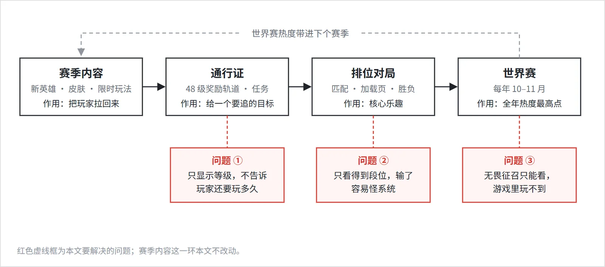

英雄联盟一年的运营大致分四段：赛季内容负责拉回玩家，通行证提供阶段目标，排位是日常的核心体验，世界赛是全年热度最高的时候。后三段各有一个问题。

| 编号 | 环节 | 玩家常见疑问 | 影响 |
|-|-|-|-|
| ① | 通行证 | 还要玩多久才能拿到想要的奖励？ | 界面只显示等级和本级经验。断档回来的玩家估不出要花多少时间，容易放弃。 |
| ② | 排位加载页 | 这局是不是匹配得不公平？ | 界面只显示段位，段位和实际水平之间有差距。输了以后，不满集中在队友和匹配系统上。 |
| ③ | 世界赛 | 能不能自己打一次无畏征召？ | 世界赛期间游戏内没有对应玩法，比赛热度没有转成游戏内的活跃。 |

# 现有系统拆解

下面把三个系统分别拆成数据字段和现有界面。需要的数据基本都已存在，缺的是展示方式。表中蓝底为本方案新增的字段。

## 通行证

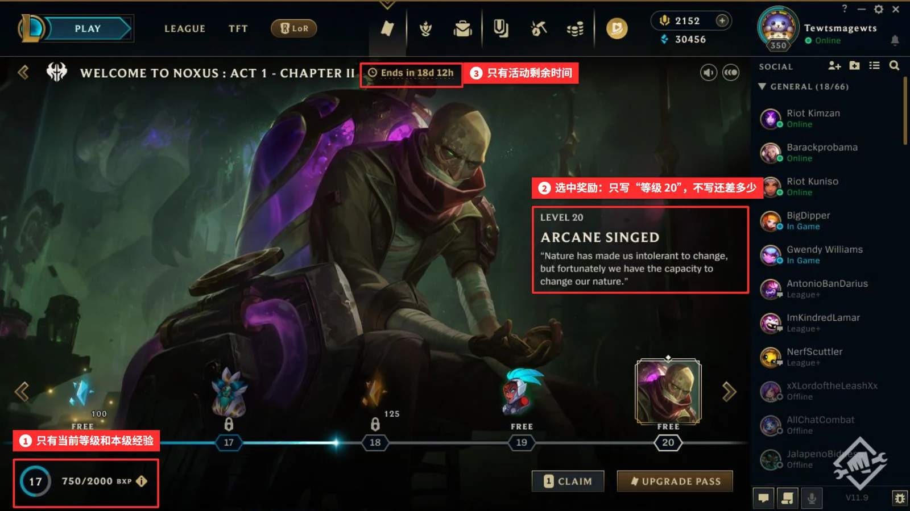

| 字段 | 含义 | 当前值 | 玩家能否看到 |
|-|-|-|-|
| level_max | 等级上限 | 48 级 | 能 |
| xp_per_level | 每级所需经验 | 400–500 BXP，每一幕单独配置 | 能 |
| xp_current | 当前累计经验 | 例：9,000 BXP（Lv 18） | 只显示本级进度（红框 1） |
| mission_expire | 任务保留期 | 21 天 | 需进入任务页查看 |
| act_end | 本幕剩余时间 | 例：18 天 12 小时 | 能（红框 3） |
| xp_rate_7d | 近 7 天每小时经验 | 可由对局记录计算 | 不能，新增展示 |
| target_reward | 玩家选定的目标奖励 | 目前只能选中查看，不能设为目标（红框 2） | 不能，新增字段 |

> **官方改动　**25.13 把周任务的保留期从 7 天延长到 21 天，25.17 把通行证从 50 级缩短到 48 级。两次改动都在降低追赶成本，说明官方希望中途断档的玩家也能追上进度。本方案沿着这个方向，补上离目标还差多少的信息。
>
> 来源：[25.13 补丁说明：周任务保留 21 天](https://www.leagueoflegends.com/en-gb/news/game-updates/patch-25-13-notes/)；[25.17 补丁说明：通行证 48 级](https://www.leagueoflegends.com/en-sg/news/game-updates/patch-25-17-notes/)

## 匹配与加载页

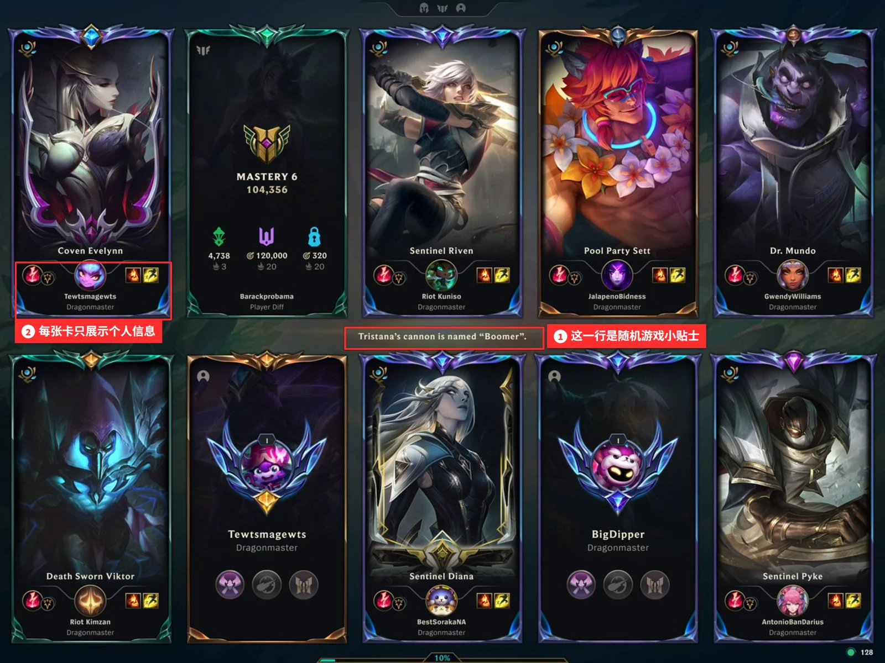

| 字段 | 含义 | 玩家能否看到 |
|-|-|-|
| rank_tier | 段位，例：黄金 II | 能，在资料页和加载页边框 |
| mmr | 隐藏分，系统用来匹配的实力估计 | 不能，只在个人段位偏低时有提示 |
| team_avg_mmr | 队伍平均分，匹配时已经算出 | 不能，新增队伍级展示 |
| loading_tip | 加载页中间的随机游戏小贴士（红框 1） | 能，但与本局无关 |

> **官方改动　**26.3 新增 Climb Indicator，在某位玩家段位低于隐藏分时给出提示，用来解释为什么铂金局里会出现白银段位的玩家。可以看出官方在尝试说明段位和实际水平的差别，同时不公开具体分数。本方案保持不公开个人分数，只在队伍层面做对比。
>
> 来源：[26.3 补丁说明：Climb Indicator](https://www.leagueoflegends.com/en-gb/news/game-updates/patch-26-3-notes/)；[2022-05-06 挑战系统说明：新加载页（图 3 来源）](https://www.leagueoflegends.com/en-us/news/game-updates/challenges-walkthrough/)

## 冠军杯赛

| 环节 | 当前规则 |
|-|-|
| 参赛资格 | 召唤师等级 ≥ 30；短信验证手机号，号码不能在多个账号之间来回换绑（解绑后需等 6 个月）；完成过排位定级 |
| 分组 | 按队伍实力分为 I–IV 组，计算时偏重队内分数最高的玩家 |
| 当天流程 | 开赛前 30 分钟全员确认，随后是 7 分钟侦察阶段（可查看对手常用英雄和胜率），再进入职业赛同款的禁选流程 |
| 赛制 | 8 队参赛，每轮 1 局；首轮输掉的队伍进入安慰赛，每队当天最多 3 局 |
| 奖励 | 每胜 400 胜利点，用于解锁旗帜和队标；按门票档次和战绩发放法球；冠军奖杯在水晶枢纽展示 2 周 |
| 选人规则 | 每局独立禁选，不跨局限制英雄 |

> **官方改动　**Worlds 2020 冠军杯赛扩大到 16 队，并加入冠军皮肤奖励。官方在 2023 年提到 ARAM 冠军杯赛的参与度是历届最高之一，同年把全年场次从 20 个周末减到 14 个，以提高每场的参与人数。防小号方面，已有短信验证和排位定级要求，官方也表示对确认的小号可能撤销其队伍奖励。可以看出官方一直在用赛事主题和新玩法拉动参与。本方案延续这一做法，把 2025 年起职业赛全面采用的无畏征召做成冠军杯赛的一个版本。
>
> 来源：[Worlds 2020 冠军杯赛说明](https://www.leagueoflegends.com/en-us/news/game-updates/worlds-2020-clash-details/)；[2023 冠军杯赛调整说明](https://www.leagueoflegends.com/en-us/news/dev/clash-changes-and-split-2-schedule/)；[Ask Riot：冠军杯赛的小号问题](https://www.leagueoflegends.com/en-us/news/dev/ask-riot-smurfs-in-clash/)；[LoL Esports：2025 赛季与无畏征召规则](https://lolesports.com/en-GB/news/lol-esports-in-2025)

## 同类产品的做法

| 产品 | 做法 | 可以借鉴的地方 |
|-|-|-|
| Dota 2 周末杯赛 | 每周一次，8 队单淘汰，连胜 3 场夺冠。冠军获得奖杯、表情和个人资料标识，大部分只保留一周。 | 频率高，但冠军荣誉保留时间短，辨识度不够。无畏杯的冠军奖励应该更长期。 |
| VALORANT Premier | 固定队伍参加每周比赛，按水平分级，最高一级可以进入官方次级职业联赛。 | 冠军和赛事体系挂钩，对玩家的意义比道具奖励更大。 |
| 王者荣耀 KPL | 职业联赛采用全局 BP：一方选过的英雄，后面的对局不能再选。 | 与无畏征召规则相同，国内观众对这类规则已有认知。 |

# 改进方案

三个方案都接在现有界面上：通行证用现有的奖励详情区，加载页用现有的小贴士位置，无畏杯沿用冠军杯赛现有的侦察和选人流程。

## 通行证目标提示

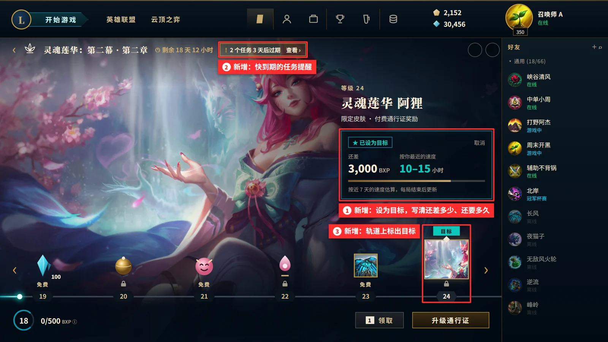

1. 设为目标：在选中奖励的详情下方增加目标卡片，显示还差 3,000 BXP，以及按玩家近 7 天速度估算的 10–15 小时，每局结束后更新。
2. 任务到期提醒：在本幕剩余时间旁提示“2 个任务 3 天后过期”，点击进入现有任务页。
3. 轨道标记：目标奖励上方显示“目标”，滑动轨道时容易找到。

| 特殊情况 | 处理方式 |
|-|-|
| 近 7 天没有对局 | 只显示还差多少经验，不估算时间 |
| 目标是付费奖励，但玩家没有购买付费通行证 | 目标卡片注明需要解锁付费通行证 |
| 按当前速度，本幕结束前拿不到 | 如实提示本幕内可能拿不到，不使用倒计时催促 |

## 加载页双方实力对比

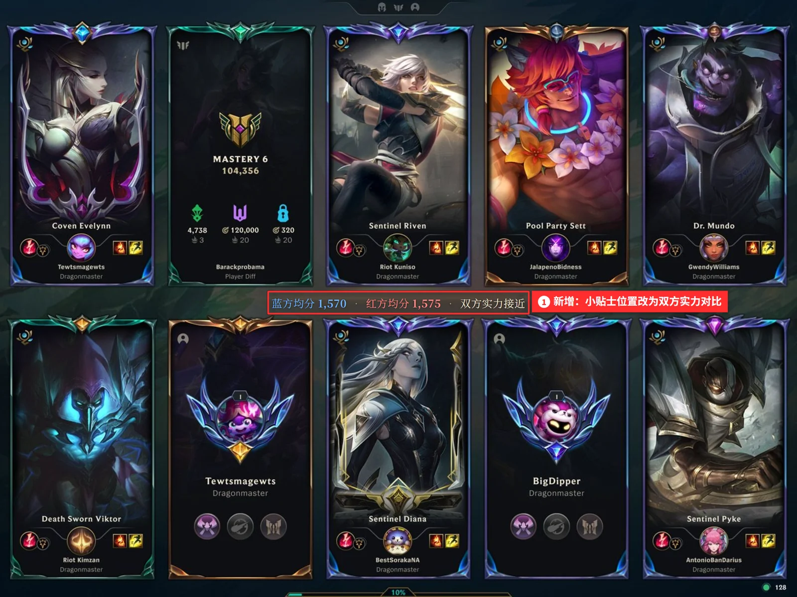

1. 把图 3 红框 1 里那行随机小贴士换成双方平均分对比：“蓝方均分 1,570　·　红方均分 1,575　·　双方实力接近”。方案图就是在官方截图上改的，卡片、边框、段位宝石、进度条都保持原样，玩家的阅读顺序不变。

不显示个人分数。个人隐藏分一旦公开，开局前就能找出分数最低的玩家，容易引发指责。队伍层面的对比只说明这局是否公平，不针对任何一名玩家。

## 世界赛无畏杯

世界赛决赛前后的周末开放一届特别版冠军杯赛，分两天进行。第 1 天完全沿用现在的规则，第 2 天只有第 1 天夺冠的队伍参加，两两配对打一场全程无畏 BO3。

| 时间 | 内容 | 规则 |
|-|-|-|
| 第 1 天（周六） | 常规冠军杯赛：8 队单淘汰，每队最多 3 局 | 与现在完全相同，每局独立禁选 |
| 第 2 天（周日） | 冠军组：第 1 天各赛程的冠军按实力组配对，打一场 BO3 | 全程无畏：双方在本系列赛中选过的英雄，后面几局都不能再选 |
| 配对规则 | 同一实力组内随机配对；冠军数为奇数时，第 1 天胜利点最高的队伍轮空 | 新增 |

### 为什么无畏放在第 2 天

无畏征召的博弈来自同一个对手的系列赛：双方轮流消耗英雄池，这一局的选择直接影响下一局的禁选和对位。如果放在第 1 天，每一轮的对手都不一样，锁住的只是自己用过的英雄，等于单方面自我限制，没有互相消耗的过程。所以第 1 天保持原样，把无畏放在第 2 天的冠军对决里。

| 赛制 | 同一对手连续对局 | 双方互相消耗英雄池 | 夺冠路径上的时间 | 结论 |
|-|-|-|-|-|
| 普通冠军杯赛（现状） | 无 | 否 | 约 2 小时 | 现状 |
| A：第 1 天每轮都打无畏 BO3 | 有 | 是 | 约 5 小时 | 时间翻倍，业余队伍难坚持 |
| B：第 1 天全日无畏（只锁自己） | 无 | 否，只锁自己用过的 | 约 2 小时 | 博弈少，等于自我限制 |
| C：两天制（推荐） | 第 2 天 BO3 | 是 | 第 1 天 2 小时 + 第 2 天约 1.7 小时 | 采用 |

### 界面

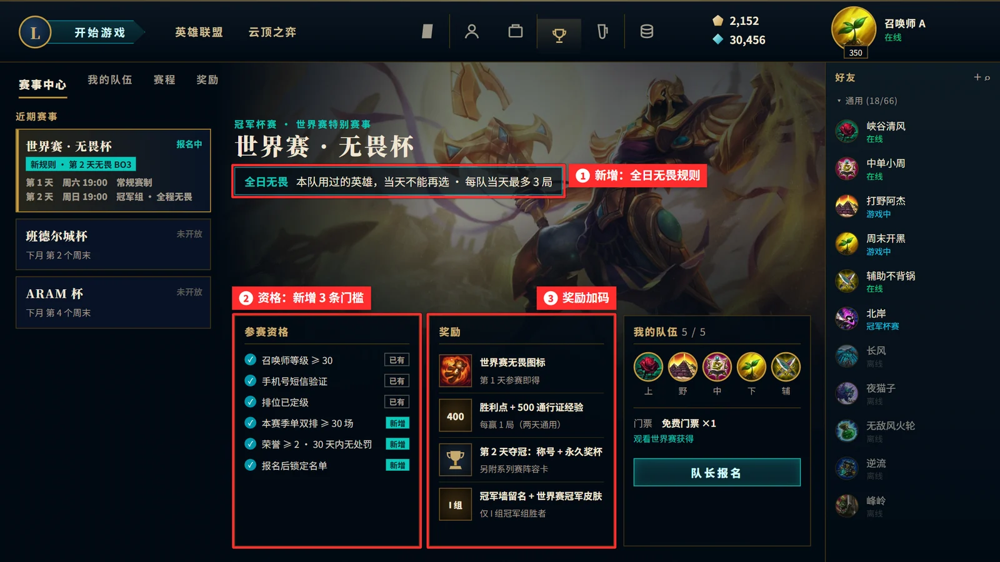

1. 赛事标题下写明两天的赛制。
2. 参赛资格：保留官方已有的 3 条，新增 3 条（见下方公平性表）。
3. 奖励预览：第 2 天夺冠的奖励改为加载页称号、永久奖杯和阵容卡，I 组冠军组胜者另有冠军墙和冠军皮肤。

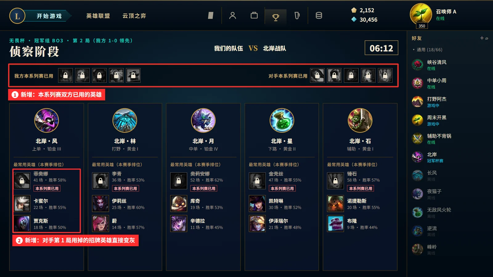

1. 侦察页顶部列出双方在本系列赛中已经用过的英雄。
2. 对手常用英雄如果已经用过，直接置灰。

例子中，对手上单最常用的菲奥娜在第 1 局已经被双方用掉，这一局只能在卡蜜尔和贾克斯里选。侦察阶段的 7 分钟因此有更多可以研究的内容。

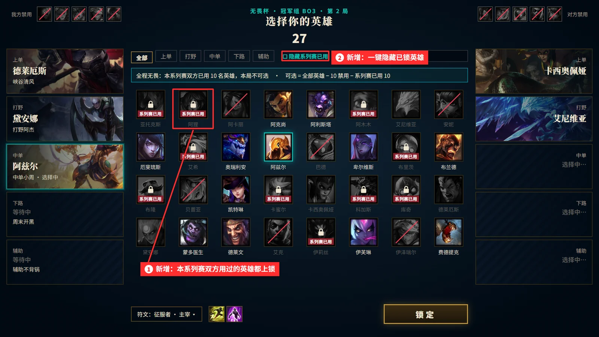

1. 双方在本系列赛用过的英雄都上锁，并与禁用（红色斜线）、对方本局已选（置灰）区分开。
2. 提供“隐藏系列赛已用”筛选，减少找英雄的时间。

两天的流程如下，新增环节在框内注明：

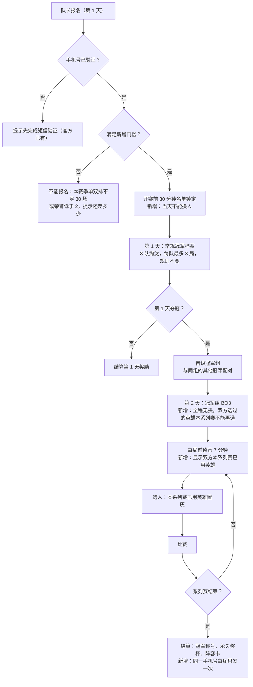

### 公平性

冠军杯赛已经要求短信验证手机号，号码也不能在多个账号之间来回换绑。无畏杯的奖励更多，开小号和重复领奖的动机也更强，因此在现有规则之上增加三项限制，并按手机号发放奖励。手机号是现有验证流程中已经收集的信息，不需要新增收集。

<table><colgroup><col/><col/><col/><col/></colgroup><thead><tr><th vertical-align="top">风险</th><th vertical-align="top">具体表现</th><th vertical-align="top">措施</th><th vertical-align="top">状态</th></tr></thead><tbody><tr><td rowspan="2" vertical-align="middle">小号</td><td rowspan="2" vertical-align="middle">高分玩家用新账号进入低组夺冠</td><td vertical-align="middle">手机号验证；按队内最高分分组；后台小号检测</td><td vertical-align="middle">官方已有</td></tr><tr><td vertical-align="middle">本赛季单双排不少于 30 场，新账号达不到就无法报名</td><td vertical-align="middle">新增</td></tr><tr><td vertical-align="middle">重复领奖</td><td vertical-align="middle">一个人用多个账号领奖</td><td vertical-align="middle">奖励按手机号发放，一个号码每届只能领一次</td><td vertical-align="middle">新增</td></tr><tr><td vertical-align="middle">代打、换人</td><td vertical-align="middle">报名后换水平更高的人上场</td><td vertical-align="middle">报名后锁定名单；登录地点或设备异常时，奖励冻结待审核</td><td vertical-align="middle">新增</td></tr><tr><td vertical-align="middle">消极比赛</td><td vertical-align="middle">输了就挂机、送人头</td><td vertical-align="middle">荣誉等级不低于 2，且近 30 天没有处罚</td><td vertical-align="middle">新增</td></tr></tbody></table>

### 奖励

普通冠军杯赛的奖励以胜利点和法球为主，冠军奖杯只展示两周。Dota 2 周末杯赛也有同样的问题：冠军荣誉保留时间短，别人很难注意到。无畏杯把第 2 天夺冠的奖励改成在游戏里长期可见的荣誉。

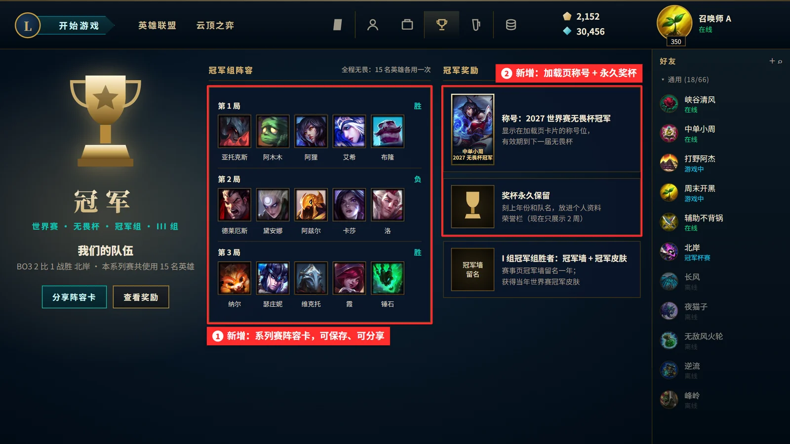

1. 系列赛阵容卡：记录这场 BO3 用过的 15 个英雄和每局胜负，可以保存和分享。无畏规则下每支冠军队伍的阵容都不同，适合作为纪念。
2. 加载页称号和永久奖杯：冠军成员获得“2027 世界赛无畏杯冠军”称号，显示在加载页卡片的称号位，有效期到下一届无畏杯。每局都有另外 9 名玩家看到。奖杯刻上年份和队名，永久放在个人资料的荣誉栏。

| 结果 | 普通冠军杯赛（现状） | 无畏杯（本方案） |
|-|-|-|
| 报名 | 购买门票或通过活动获得 | 观看世界赛可掉落一张免费门票 |
| 第 1 天参赛 | 按门票档次和战绩发放法球 | 同左，另加世界赛无畏图标 |
| 每赢 1 局（两天通用） | 400 胜利点 | 400 胜利点 + 500 通行证经验 |
| 第 1 天打满 2 局 | 无 | 无畏限定表情 |
| 第 1 天夺冠 | 奖杯展示 2 周 | 晋级第 2 天冠军组，保留原有奖杯 |
| 第 2 天夺冠 | 无对应档次 | 永久奖杯 + 加载页称号（一年）+ 系列赛阵容卡 |
| I 组冠军组胜者 | 无对应档次 | 另加赛事页冠军墙留名一年、当年世界赛冠军皮肤 |

冠军皮肤有先例：Worlds 2020 冠军杯赛给前几名发放过冠军皮肤。其余冠军奖励都是称号、奖杯、展示位这类数字内容，边际成本低。每赢一局加 500 通行证经验，让无畏杯同时推进问题 ① 中的通行证进度。

# 数据对比与测算

## 通行证

$$T=\frac{X_{target}-X_{now}}{v_{7d}}=\frac{12000-9000}{200\sim300}=10\sim15\ \text{h}$$

X 为累计经验，v 为玩家近 7 天每小时获得的经验（含已完成任务）。未完成任务的经验不提前计入。

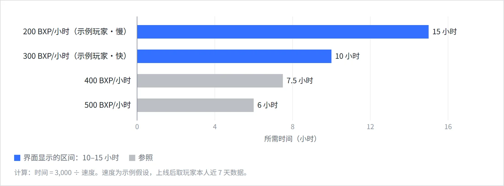

| 玩家想知道 | 现状 | 方案 |
|-|-|-|
| 离想要的奖励还差多少 | 只显示本级进度，需要自己换算 | 直接显示还差 3,000 BXP |
| 还要玩多久 | 无法得知 | 预计 10–15 小时 |
| 先做哪个任务 | 进入任务页逐个查看 | 顶部提示快到期的任务 |
| 需要新增的数据 | 无 | 无，经验、速度、任务数据都已存在 |

## 加载页

$$\bar{M}=\frac{1}{5}\sum_{i=1}^{5}M_i\qquad \Delta=\left|\bar{M}_{blue}-\bar{M}_{red}\right|$$

示例：蓝方 (1,540 + 1,580 + 1,600 + 1,570 + 1,560) ÷ 5 = 1,570，红方为 1,575，差距 Δ = 5，显示双方实力接近。

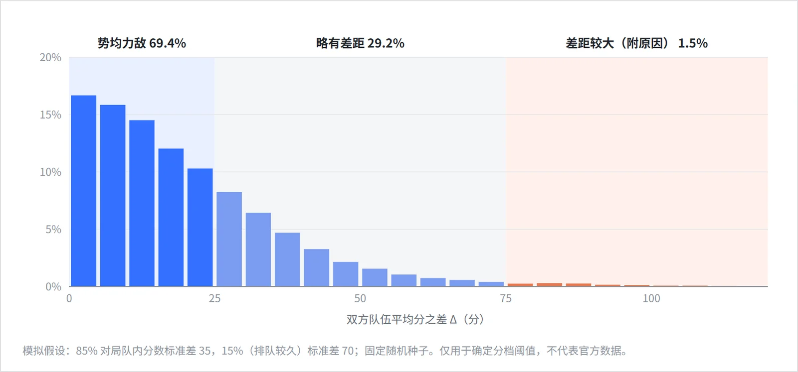

| 差距 Δ | 模拟占比 | 显示文字 | 理由 |
|-|-|-|-|
| 小于 25 | 69.4% | 双方实力接近 | 多数对局落在这一档，给玩家一个明确的公平确认 |
| 25–75 | 29.2% | 略有差距，蓝方（红方）稍高 | 只说明方向，不给个人数字 |
| 75 及以上 | 1.5% | 显示差距和原因，例如排队超过 2 分钟后系统放宽了匹配范围 | 让玩家知道差距来自匹配规则，而不是队友 |

| 显示方式 | 能回答什么 | 风险 | 结论 |
|-|-|-|-|
| 只显示段位（现状） | 每个人的段位 | 段位和实际水平有差距，输了容易怪匹配 | 不够 |
| 显示每个人的隐藏分 | 信息最全 | 开局就能找出最低分的玩家，容易引发指责 | 不采用 |
| 只显示队伍均分（本方案） | 双方整体是否接近 | 看不到具体对位的差距 | 采用，上线前先测试 |

## 无畏杯

$$P_k=N-10-10(k-1)$$

P 为第 2 天系列赛中第 k 局可选的英雄数，N 为全部英雄数，10 为本局双方禁用数，10(k-1) 为双方在前几局已经用掉的英雄。按 N ≈ 170 估算，三局分别约 160、150、140 个。英雄池依然够用，但每名玩家至少要准备 3 个能打的英雄，第 3 局的禁选空间也会明显变化。

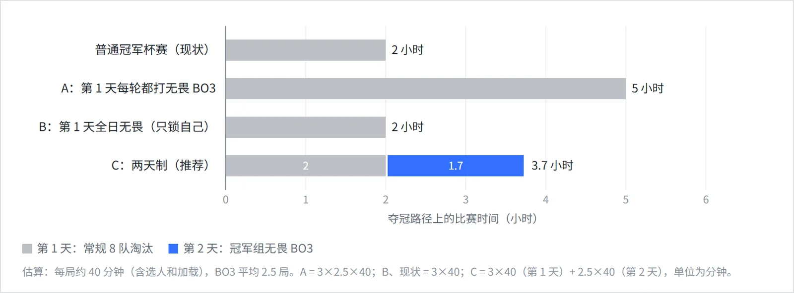

| 赛制 | 夺冠路径时间 | 每人至少准备 | 双方互相消耗英雄池 | 结论 |
|-|-|-|-|-|
| 普通冠军杯赛（现状） | 约 2 小时 | 1 个英雄 | 否 | 现状 |
| A：第 1 天每轮都打无畏 BO3 | 约 5 小时 | 3 个 | 是 | 时间翻倍 |
| B：第 1 天全日无畏 | 约 2 小时 | 3 个 | 否 | 只锁自己，博弈少 |
| C：两天制 | 2 + 1.7 小时 | 3 个 | 是（第 2 天） | 采用 |

## 投入产出

以下按两个假设估算：人力成本 2 万元/人周，付费通行证每张收入 70 元。实际使用时需要替换成内部数据。

$$N=\frac{C}{R}=\frac{12\times 20000}{70}\approx 3430$$

N 为回本所需的新增付费通行证数量，C 为开发成本（元），R 为每张付费通行证的收入（元）。

| 项目 | 成本 | 收益来源 | 回本条件 | 判断 |
|-|-|-|-|-|
| 通行证目标提示 | 12 人周，约 24 万元 | 付费通行证购买、回流玩家留存 | 多卖约 3,430 张付费通行证 | 只需要一小部分回流玩家因为看到剩余时间而决定购买 |
| 世界赛无畏杯 | 32 人周，约 64 万元 | 世界赛期间的活跃，以及由通行证经验带动的付费 | 按活动预算评估：参赛 10 万人时，约 6 元/人 | 与同期其他世界赛活动比较每位参与玩家的成本 |
| 加载页队伍均分 | 10 人周，约 20 万元 | 不直接产生收入，目标是降低举报和中途退出 | 先投入 2 人周做测试 | 测试不达标就停止，损失可控 |

# 结论

三个问题有一个共同点：数据和玩法都已经存在，缺的是在合适的位置把信息告诉玩家。因此三项改动都不改核心玩法，只在现有界面和流程里补充信息或规则。建议按下面的顺序推进。

| 顺序 | 改动 | 依据 | 成本（估算） | 上线时间 | 成功标准 |
|-|-|-|-|-|-|
| 1 | 通行证目标提示 | 25.13、25.17 都在降低追赶成本；所需数据全部现成 | 约 12 人周：策划 2、客户端 5、服务端 3、测试 2 | 2027 赛季第一幕 | 理解测试中至少 80% 的玩家能说出还要玩多久；回流玩家 14 天内领到目标奖励的比例高于对照组 |
| 2 | 世界赛无畏杯 | Worlds 2020 冠军杯赛和 ARAM 冠军杯赛说明主题和新玩法能拉动参与；无畏的博弈需要同一对手的系列赛，因此放在第 2 天的冠军组 | 约 32 人周：服务端 10、客户端 8、策划 4、美术 4、测试 4、冠军组配对 2 | MSI 2027 试点，2027 世界赛正式上线 | 第 1 天报名队伍数高于同期普通冠军杯赛；第 2 天出场的英雄种类多于第 1 天；小号举报不增加 |
| 3 | 加载页队伍均分 | 26.3 已开始提示隐藏分；模拟中约 7 成对局显示实力接近 | 约 10 人周：客户端 4、服务端 2、用户研究 2、测试 2 | 先做原型测试，2027 年中小范围实验 | 赛后举报率、中途退出率不高于对照组；理解测试正确率上升 |

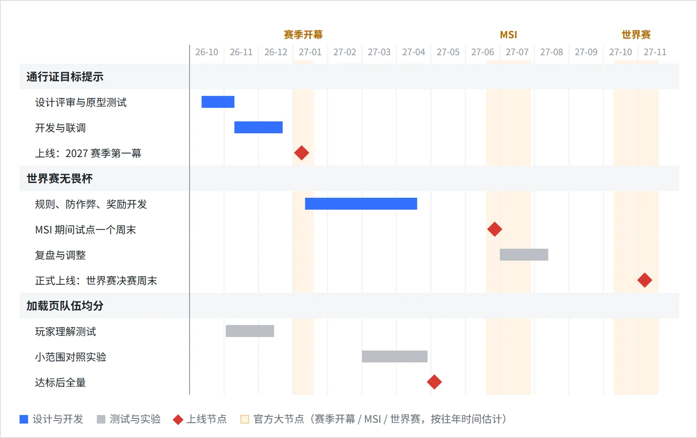

## 验证方式

通行证和加载页用对照实验验证。以回流玩家 14 天内领到目标奖励的比例为例，假设对照组为 30%，希望能检测出 2 个百分点的提升：

$$n=\frac{(z_{0.975}+z_{0.8})^2\,[p_1(1-p_1)+p_2(1-p_2)]}{(p_2-p_1)^2}=\frac{2.80^2\times(0.21+0.2176)}{0.02^2}\approx 8390$$

每组约 8,400 名回流玩家即可得出结论。上线前先找 5–8 名玩家做界面理解测试。无畏杯按试点对比：同一时间段内，比较无畏杯和普通冠军杯赛的报名队伍数、出场英雄种类数和小号举报量。

## 没有选的方向

| 方向 | 没有选的原因 |
|-|-|
| 补位保分评分（原报告提案） | 26.15 已取消补位败局保分和评级门槛，官方已经处理 |
| 低信誉玩家隔离队列（原报告提案） | 误判、申诉和队列人数的影响都需要内部数据，外部无法评估 |
| 公开每个人的隐藏分 | 容易引发指责，对比见 4.2 |

## 风险与应对

| 风险 | 应对 |
|-|-|
| 预计时间不准，玩家觉得被误导 | 只用本人近 7 天的数据；样本不足时只显示还差多少经验；显示区间，不显示单一数字 |
| 队伍均分引发新的争议 | 不显示个人分数；先做原型测试；数据异常时退回只显示段位 |
| 无畏杯门槛挡住普通玩家 | 30 场只占一个赛季排位的一小部分；ARAM 等不设排位门槛的冠军杯赛照常开放 |
| 第 2 天只有冠军能打，多数玩家参与不到 | 第 1 天规则不变，所有人都能打；第 2 天的比赛提供观战和回放，阵容卡可以分享。如果参与度高，下一届可以把冠军组扩成 4 队小组赛 |
| 世界赛决赛观赛和比赛时间冲突 | 比赛安排在决赛前一个周末或决赛后第二天；观赛掉落门票，先看比赛再参赛 |
| 小号和代打 | 手机号去重、名单锁定，加上官方已有的小号检测；确认违规后撤销全队奖励 |
| 个人信息合规 | 只使用现有短信验证中已有的手机号，按手机号去重时不向其他玩家展示任何信息 |

**最终建议：**先上线通行证目标提示，只改界面，约 12 人周，2027 赛季第一幕即可上线。同时启动无畏杯开发，赶在 MSI 2027 试点两天赛制。加载页队伍均分风险最高，先做玩家测试再决定是否上线。

说明：玩家速度、队伍分数、赛制时长、人周成本和收入均为示例或估算；官方规则均附原始链接。英雄原画、图标和官方截图的版权归 Riot Games；方案界面使用 Riot Data Dragon 公开素材，加载页方案图是在官方 2022-05-06 加载页截图上直接修改的，只替换了中间一行文字。

# 参考资料

- [25.13 补丁说明：周任务保留 21 天](https://www.leagueoflegends.com/en-gb/news/game-updates/patch-25-13-notes/)
- [25.17 补丁说明：通行证 48 级](https://www.leagueoflegends.com/en-sg/news/game-updates/patch-25-17-notes/)
- [2024-11-25 开发者文章：2025 赛季与新通行证（图 2 来源）](https://www.leagueoflegends.com/en-us/news/dev/dev-seasons-in-2025/)
- [2022-05-06 挑战系统说明：新加载页（图 3 来源）](https://www.leagueoflegends.com/en-us/news/game-updates/challenges-walkthrough/)
- [26.3 补丁说明：Climb Indicator](https://www.leagueoflegends.com/en-gb/news/game-updates/patch-26-3-notes/)
- [26.15 补丁说明：取消补位败局保分与评级门槛](https://www.leagueoflegends.com/en-us/news/game-updates/league-of-legends-patch-26-15-notes/)
- [冠军杯赛 FAQ（Riot 支持页）](https://support.riotgames.com/en-us/league-of-legends/events/clash-faq)
- [Worlds 2020 冠军杯赛说明](https://www.leagueoflegends.com/en-us/news/game-updates/worlds-2020-clash-details/)
- [2023 冠军杯赛调整说明](https://www.leagueoflegends.com/en-us/news/dev/clash-changes-and-split-2-schedule/)
- [Ask Riot：冠军杯赛的小号问题](https://www.leagueoflegends.com/en-us/news/dev/ask-riot-smurfs-in-clash/)
- [LoL Wiki：冠军杯赛流程](https://wiki.leagueoflegends.com/en-us/Clash)
- [LoL Esports：2025 赛季与无畏征召规则](https://lolesports.com/en-GB/news/lol-esports-in-2025)
- [Dota 2 Wiki：Weekend Battle Cup](https://dota2.fandom.com/wiki/Weekend_Battle_Cup)
- [VALORANT：Premier FAQ](https://playvalorant.com/en-us/news/game-updates/premier-global-open-beta-faq/)
- [王者荣耀官网：2024 KPL 夏季临时席位资格赛规则（全局 BP）](https://pvp.qq.com/gicp/news/651/623058.html)
